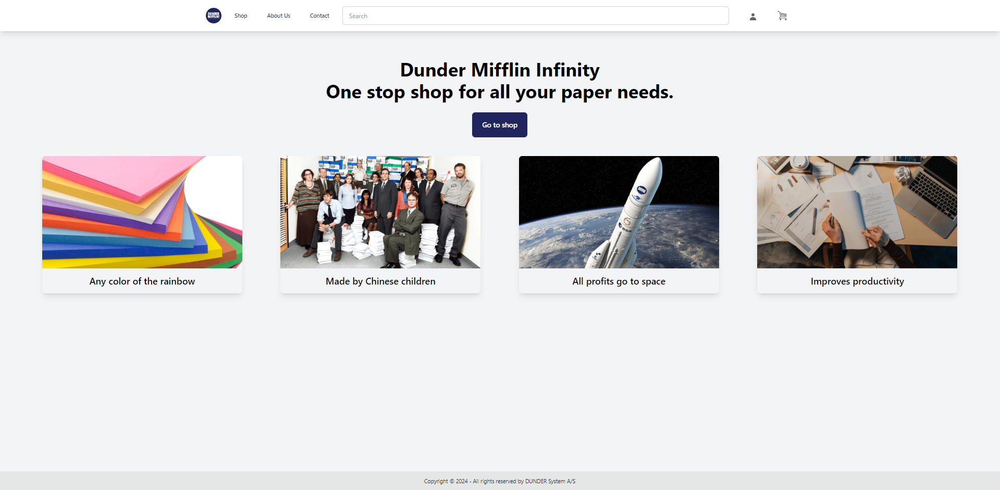

# Dunder Mifflin Infinity

## Description

# EASV Project Autumn 2024
# Frontend:
- React, Typescript (vite)
- React router dom
- Jotai
- Tailwindcss, DaisyUI
- React Hot Toast

# Backend:
- C#, ASP.NET
- Axios
- Swagger
- Swagger-typescript-api
- PostgreSQL
- Entity Framework Core
- Docker

# Unit tests:
- xUnit

## Authors

Contributors names and GitHub link

Daniel S [GitHub](https://github.com/Daniel12345rs01)  
Naylin H [GitHub](https://github.com/NaylinHla) 
Thomas O [GitHub](https://github.com/Yatokuri/) 

## Version History
* 0.1
    * Initial Release
* 0.2
    * Updated Alpha
* 0.3
    * Beta Release

## License

This project is licensed under the Create Common License - see the LICENSE.md file for details